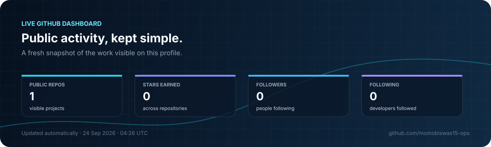
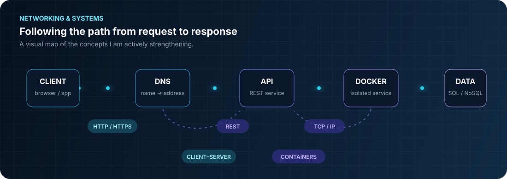

 

# Md Mubaswir Biswas

### Aspiring Software Developer

**Building practical, maintainable, and well-documented software.**

---

## A little about me

I am an aspiring software developer from India, focused on turning ideas into clear, reliable, and useful applications. I am building my foundation through hands-on projects and deliberate practice, with a particular interest in readable code, thoughtful architecture, and strong documentation.

> **Current chapter:** building the fundamentals, shipping small projects, and improving one iteration at a time.

## Developer snapshot

| | Focus |
| --- | --- |
| **I am building** | Full-stack foundations and complete portfolio projects |
| **I am learning** | TypeScript, React, Node.js, and system-design fundamentals |
| **I value** | Clarity, maintainability, documentation, and continuous improvement |
| **I am open to** | Junior software roles, internships, collaboration, and open source |

## Live profile metrics

  

 

The dashboard refreshes daily from public GitHub data. Profile views are counted separately.

## Toolbox

## Networking & systems focus

I am actively strengthening my understanding of how software moves through a system: from a client request and DNS lookup to an HTTP/REST API, a containerized service, and persistent data. This is a learning focus, not a claim of production networking expertise.

## What you will find here

I am intentionally building a portfolio of **small, complete, and useful projects** rather than collecting unfinished demos. As each project becomes ready, I will add it here with a clear README, setup instructions, screenshots where helpful, and the engineering decisions behind it.

For now, this profile is the starting point: a public record of the skills I am developing and the standards I want to bring to every project.

## How I work

- **Clarity first:** write code that another person can understand and maintain.
- **Build to learn:** turn concepts into working software through practical projects.
- **Document decisions:** make setup, trade-offs, and next steps easy to follow.
- **Improve continuously:** review, refactor, test, and ship a better iteration.

<strong>My current learning loop</strong>

 

1. Choose a small, real problem.
2. Design the simplest useful version.
3. Build with readable structure and sensible defaults.
4. Test the important paths and document the result.
5. Reflect, refactor, and carry the lesson into the next project.

---

### Let’s build something useful.

[Email Md Mubaswir Biswas](mailto:momobiswas15@gmail.com) · [Explore the repositories](https://github.com/momobiswas15-ops?tab=repositories)

 

Build with intent. Learn in public. Improve relentlessly.

